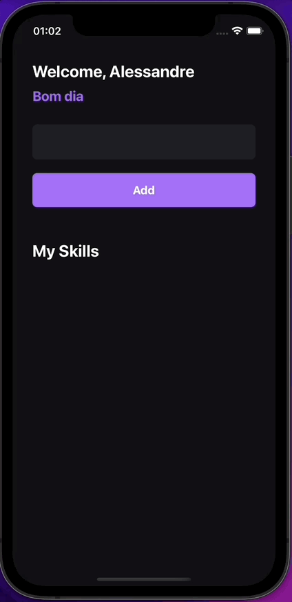

<div align="center" style="padding-bottom:30px; background:transparent">

</div>

## 💻 Projeto

MySkills é um aplicativo desenvolvido no curso Ignite da Rocketseat.

## 🚀 Tecnologias utilizadas

- [React native](https://reactnative.dev)
- [TypeScript](https://www.typescriptlang.org/)

### Instalação

Clone o repositório do Projeto

```
https://github.com/alessandre74/myskills.git
```

Acesse o diretório do projeto

```
cd myskylls
```

Instale as dependências

````
yarn ou sudo yarn

```
ou

````

npm install ou sudo npm install

```

Instalar dependências cocoapods

```

estando na pasta myskylls, entre na pasta ios
e execute o comando pod install, depois volte
para pasta myskylls.

```

Start o aplicativo

```

yarn start

```

Inicie o aplicativo no iOS

```

yarn ios ou npm run ios

```

Inicie o aplicativo no Android

```

yarn android ou npm run android

```

```

OBS: Caso acontece algum problema de build do projeto execute os comando abaixo:
1 - watchman watch-del-all
2 - yarn cache clean ou npm run cache
3 - yarn start -- --reset-cache
4 - yarn ios ou npm run ios (para IOS)
5 - yarn android ou npm run android (para Android)

```

## 📄 License

```

Este projeto está sob a licença MIT

```

```
